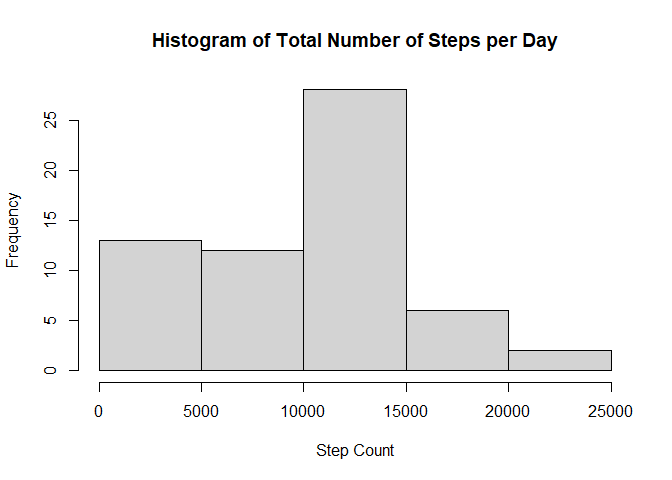

## Loading and preprocessing the data

```r
library(dplyr)
```

```
## 
## Attaching package: 'dplyr'
```

```
## The following objects are masked from 'package:stats':
## 
##     filter, lag
```

```
## The following objects are masked from 'package:base':
## 
##     intersect, setdiff, setequal, union
```

```r
library(lattice)
df<-read.csv("activity.csv", na.strings="NA")
df$date<-as.Date(df$date, "%Y-%m-%d") 
```


## What is mean total number of steps taken per day?

1.  Calculate the total number of steps taken per day:

```r
total_steps<-aggregate(df$steps, list(df$date), FUN=sum, 
                       na.rm=TRUE)
colnames(total_steps)<-c("date", "steps")
```

2.  Make a histogram of the total number of steps taken each day:

```r
hist(total_steps$steps, main="Histogram of Total Number of Steps per Day",
     xlab="Step Count")
```

<!-- -->

3.  Calculate and report the mean and median of the total:

```r
step_mean<-mean(total_steps$steps, na.rm=TRUE)
step_median<-median(total_steps$steps, na.rm=TRUE)
```
The mean is 9354.2295082 and the median is 10395.


## What is the average daily activity pattern?

1.  Make a time series plot of the 5-minute interval and the average number of steps taken, averaged across all days:

```r
avg_interval<-aggregate(df$steps, list(df$interval), FUN=mean,
                        na.rm=TRUE)
colnames(avg_interval)<-c("interval", "avg_steps")
plot(avg_interval$interval, avg_interval$avg_steps, type="l",
     main="Avg Number of Steps Taken Across 5 Minute Intervals",
     xlab="Time Interval (in 5 min increments)",
     ylab="Avg Number of Steps")
```

<!-- -->

2.  Which 5-minute interval, on average across all the days in the dataset, contains the maximum number of steps?

```r
i<-which.max(avg_interval$avg_steps) #index of max steps
int<-avg_interval$interval[i] # find interval
int
```

```
## [1] 835
```
Answer:  The interval 835 contains the maximum number of steps.


## Imputing missing values

1.  Calculate and report the total number of missing values in the dataset. 

```r
miss<-sum(is.na(df))
miss
```

```
## [1] 2304
```
Answer:  There are 2304 missing values in the dataset.

2.  Devise a strategy for filling in all of the missing values. 
Answer:  For any missing data, I will fill in the mean for the applicable 5-minute interval.

3.  Create a new dataset that is equal to the original dataset by with the missing data filled in.

```r
d2<-data.frame(df)
for (i in 1:nrow(d2)) {
    if (is.na(d2$steps[i])) {
        inter<-d2$interval[i]
        myrow<-filter(avg_interval, avg_interval$interval==inter)
        d2$steps[i]<-myrow$avg_steps    
    }
}
head(d2)
```

```
##       steps       date interval
## 1 1.7169811 2012-10-01        0
## 2 0.3396226 2012-10-01        5
## 3 0.1320755 2012-10-01       10
## 4 0.1509434 2012-10-01       15
## 5 0.0754717 2012-10-01       20
## 6 2.0943396 2012-10-01       25
```

4.  Make a histogram of the total number of steps taken each day and Calculate and report the mean and median total number of steps taken per day. Do these values differ from the estimates from the first part of the assignment? What is the impact of imputing missing data on the estimates of the total daily number of steps?

```r
total_steps2<-aggregate(d2$steps, list(d2$date), FUN=sum, 
                       na.rm=TRUE)
colnames(total_steps2)<-c("date", "steps")
```

```r
hist(total_steps2$steps, main="Histogram of Steps per Day w/Imputed Data",
     xlab="Step Count")
```

<!-- -->

```r
step_mean2<-mean(total_steps2$steps, na.rm=TRUE)
step_median2<-median(total_steps2$steps, na.rm=TRUE)
```
The mean is 1.0766189\times 10^{4} and the median is 1.0766189\times 10^{4}.  These values do not
differ materially from the values in the first part of the assignment.


## Are there differences in activity patterns between weekdays and weekends?

1.  Create a new factor variable in the dataset with two levels -- "weekday" and "weekend" indicating whether a given date is a weekday or weekend day.

```r
d2$weekdays<-factor(format(d2$date, '%A'))
levels(d2$weekdays)
```

```
## [1] "Friday"    "Monday"    "Saturday"  "Sunday"    "Thursday"  "Tuesday"  
## [7] "Wednesday"
```

```r
levels(d2$weekdays)<-list("weekday"= c("Monday", "Tuesday", "Wednesday", "Thursday",
                                      "Friday"), "weekend"=c("Saturday", "Sunday"))
avg_interval2<-aggregate(d2$steps, list(d2$weekdays, d2$interval), FUN=mean,
                        na.rm=TRUE)
colnames(avg_interval2)<-c("day", "interval", "steps")
```

2.  Make a panel plot containing a time series plot (i.e. type = "l") of the 5-minute
interval (x-axis) and the average number of steps taken, averaged across all 
weekday days or weekend days (y-axis).

```r
g<-xyplot(avg_interval2$steps ~ avg_interval2$interval | avg_interval2$day, data=avg_interval2, 
       layout=c(1,2), type="l", xlab="Interval", ylab="Steps", main="Average Steps Taken per Interval")
g
```

<!-- -->
